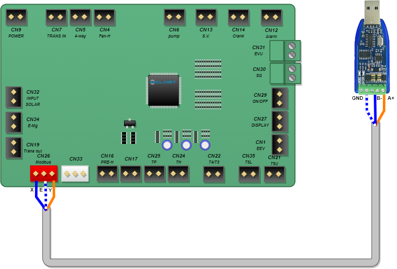

# clivet-BMS-integration

[](https://github.com/hacs/integration)
[](https://github.com/sinseman44/clivet-BMS-Integration/blob/main/LICENSE)
[](https://github.com/sinseman44/clivet-BMS-Integration/releases)
<br />


_Disclaimer : This is not a clivet official integration and use at your own risk._

**clivet-BMS-Integration** is an integration of clivet water heater system into Home Assistant using BMS (Building Management System) and Modbus protocol RTU (RS485) or TCP.
 
## Building Management System (BMS)

With BMS, owners can monitor and manage systems, such as air conditioning, heating, ventilation, lighting or energy supply systems.
Some objectives of building automation are improved occupant comfort, efficient operation of building systems, reduction in energy consumption, reduced operating and maintaining costs and increased security.

Most building automation networks consist of a primary and secondary bus which connect high-level controllers with low-level controllers, input/output devices and a user interface.
Physical connectivity between devices waq historically provided by dedicated optical fiber, ethernet, ARCNET, RS-232, **RS-485** or a low-bandwidth special purpose wireless network.

## Modbus RTU

**Modbus** is a client/server data communications protocol in the application layer of the OSI model. Modbus was developped for industrial applications, is relatively easy to deploy and maintain compared to other standards, and places few restrictions on the format of the data to be transmitted.

Communication standards or buses which is deployed for Modbus communication are:
* TCP/IP over Ethernet
* Asynchronous serial communication in a wide range of standards, technologies : EIA/TIA-232-E, EIA-422, EIA/TIA-485-A, fiber, radio frequency.
* Modbus PLUS, a high speed token passing network

Modbus standard defines MODBUS over Serial Line, a protocol over the Data link layer of the OSI model for the Modbus application layer protocol to be communicated over a serial bus. Modbus Serial Line protocol is a master/slave protocol which supports one master and multiple slaves in the serial bus.
A serial bus for Modbus over Serial Line can maximum 247 slaves to communicate with 1 master, those slaves then must their unique address range from 1 to 247.
Modbus over Serial Line has two transmission modes RTU and ASCII which are corresponded to two versions of the protocol, known as Modbus RTU and Modbus ASCII.

Modbus RTU (Remote Terminal Unit), makes use of a compact, binary representation of the data for protocol communication. The RTU format follows the commands/data with a cyclic redundancy check checksum as an error check mecahnism to ensure the reliability of data.

## Modbus TCP

Modbus TCP/IP (also Modbus-TCP) is simply the Modbus RTU protocol with a TCP interface that runs on Ethernet.
Modbus TCP/IP uses TCP/IP and Ethernet to carry the data of the Modbus message structure between compatible devices. That is, Modbus TCP/IP combines a physical network (Ethernet), with a networking standard (TCP/IP), and a standard method of representing data (Modbus as the application protocol). Essentially, the Modbus TCP/IP message is simply a Modbus communication encapsulated in an Ethernet TCP/IP wrapper. 

# Support

<a href="https://www.buymeacoffee.com/sinseman44" target="_blank"></a>

# Todo 📃 and Bug report 🐞

See [Github To Do & Bug List](https://github.com/sinseman44/clivet-BMS-Integration/issues)

# Getting Started

## Architecture

Two different architectures, a first wired one where the Clivet system is connected to the Home Assistant server via a USB/RS485 dongle and a second one wirelessly, the Clivet system is connected to the RS485/WIFI device which is connected to the same WIFI network as the Home Assistant server.


_In IEEE 802.11 (Wi-Fi) terminology, a station (abbreviated as STA) is a device that has the capability to use the 802.11 protocol. For example, a station may be a laptop, a desktop PC, PDA, access point or Wi-Fi phone. An STA may be fixed, mobile or portable._

## Requirements

* An installation of Home Assistant with free USB port (for wired systems).
* A RS485 USB dongle (Example: DSD Tech SH-U11) for wired systems or a RS485/WIFI device (Example: Elfin EW11A or Elfin EW11-0, [example of configuration](EW11-config.md)) for wireless systems.
* A clivet water heater system.
* Enabling Modbus communication.
* A __XHB2.54-3Y__ connector for the Modbus connector on the clivet motherboard.


## Connecting

### with clivet main board and RS485 USB Dongle



* Connector CN26 Modbus Y to USB dongle A+
* Connector CN26 Modbus X to USB dongle B-
* Connector CN26 Modbus E to USB dongle GND

### with clivet main board and RS485/Wifi Device


* Connector CN26 Modbus Y to RS485/Wifi Device A+
* Connector CN26 Modbus X to RS485/Wifi Device B-
* Connector CN26 Modbus E to RS485/Wifi Device GND

## Installation

Install using HACS In HACS go to the three dots int the upper right corner choose add custom repository and add https://github.com/sinseman44/clivet-BMS-Integration to the list.<br />
Install manually Clone or copy this repository and copy the folder `custom_components/clivet_bms` into `/custom_components/clivet_bms`.<br />

[](https://my.home-assistant.io/redirect/hacs_repository/?owner=sinseman44&repository=clivet-BMS-Integration&category=integration)
[](https://my.home-assistant.io/redirect/config_flow_start/?domain=clivet_bms)

## Home Assistant RS485/USB dongle recognition

After plugging the USB dongle into the system, check that among the tty, it's recognized by Home Assistant.<br />
Example : ttyUSB0 is the node added for the device. The absolute path of this node (eg: /dev/ttyUSB0) will be used in the component configuration.<br />


# Clivet BMS Installation

The first page after installing the component is the choice of Modbus communication.
* Modbus TCP (for wireless system)
* Modbus RTU (for wired system)


Depending on the choice made, the next step is the Modbus RTU configuration or the Modbus TCP configuration.<br />

## Clivet RTU Installation

All serial fields are filled with default values defined by Clivet.<br />
Adapt the fields according to your own configuration.<br />


> [!NOTE]
> Each control unit has a specific address (default 1). Possible addresses are 1 to 247.

## Clivet TCP Installation

All fields are filled with default values.<br />
Adapt the fields according to your own configuration.<br />


# Features

- Integrates local API to read/write Modbus clivet registers
- Provides `water_heater`, `sensors`, `binary_sensors` and `switch`

## Water_heater

The unit has two types of heat sources: heat pump (compressor) and resistance. The unit automatically selects the most suitable heat source to heat the water to the desired temperature.
The heat source is selected automatically by the unit, but it is also possible to use the resistance manually.

The default heat source is the heat pump. If the outdoor temperature is outside the operating range of the heat pump, the heat pump will turn off, the unit will automatically activate the electric heater.
if the outdoor temperature returns to the operating range of the heat pump, the electrical resistance deactivates and the heat pump is automatically reactivated.


the current temperature is the result of 2 temperature sensors present in the tank (Water temperature in lower position and Water temperature in upper position).
This value can be calculated in 3 different ways :
- The maximum between the 2 temperature sensors (default use by the unit display)
- The minimum between the 2 temperature sensors
- The average between the 2 temperature sensors

### Vacation Mode
When the "VACATION" button is pressed (mode AWAY), the appliance maintains the water at 15°C during the specified period of absence. This saves energy.
The default vacation days are 14. they can be set in a range of 1 to 360 (__only on the unit__).

## Sensors and binary sensors


The following attributes are available for `sensor` platform entities:
- 4 way valve (On/Off)
- Compressor (On/Off)
- Compressor current
- Compressor exhaust temperature
- Compressor running time (seconds)
- Condenser temperature
- Defrost status (On/Off)
- Display temperature (Current temperature set in the unit display)
- Electric Heater (On/Off)
- Outdoor ambient temperature
- Suction temperature
- Water temperature in lower tank position
- Water temperature in upper tank position


### Diagnostic


The following attributes are available for diagnostic `sensor` platform entities:
- Alarm (On/Off)
- Clivet Modbus connection
- Error Code
- Fan speed (Off/Low/Medium/High)
- Modbus debug switch => To activate or deactivate Modbus frame in home_assistant.log
- Solar kit status (On/Off)
- Solar panel water pump (On/Off)
- Wifi connection status (On/Off)
- Model
- PCB firmware version
- Wire controller firmware version

## Switch


The following parameters can be controlled for the `switch` platform entities:
- Disinfect Mode
- Remoter Mode
- Smart Grid
- Solar Signal EVU
- Unit (°C or °F)

### Smart Grid management

The unit is Smart Grid Ready certified and is equipped with logic for connection to devices that balance the loads connected to the electrical grid and optimize the overall consumption of electrical energy. 
The connection is optional, the function can be activated by the keypad and is linked to the ON/OFF SG input, which receives a status signal from the electrical grid. 
The function is enabled by default, it does not require any keypad configuration and is linked to the ON/OFF EVU input, which receives a signal from the energy meter indicating when there is an overproduction of free energy for the unit. 
The unit is also configured for self-consumption of the overproduced energy thanks to a photovoltaic system, used to store thermal energy free of charge in the DHW water heater

| Energy Cost     |  SG   | EVU      | Work    |
|---              |:-:    |:-:       |---      |
| Free            |  ON   | ON       | The set point is forced to TS = 70 °C, The electrical resistance is activated if T5U < 65 °C and is deactivated when T5U ≥ 70 °C        |
| Economic        |  OFF  | ON       | The set point is forced to TS = 70 °C, The electrical resistance is activated if T5U < 65 °C and is deactivated when T5U ≥ 70 °C        |
| Default         |  OFF  | OFF      | Default        |
| Expensive       |  ON   | OFF      | The anti-legionella cycle will be carried out in accordance with the configurations indicated     |


### Disinfect mode
In "Disinfect" mode, the unit starts heating the water to a temperature of 70°C in order to kill any legionella bacteria present in the tank. 
The operating mode will deactivate when 70°C is reached.

# Debugging

Whenever you write a bug report, it helps tremendously if you indicate sufficient debug logs directly (otherwise we will just ask for them and it will take longer). So please enable debug logs like this and include them in your issue:
```yaml
logger:
  default: warning
  logs:
    custom_components.clivet_bms: debug
```
